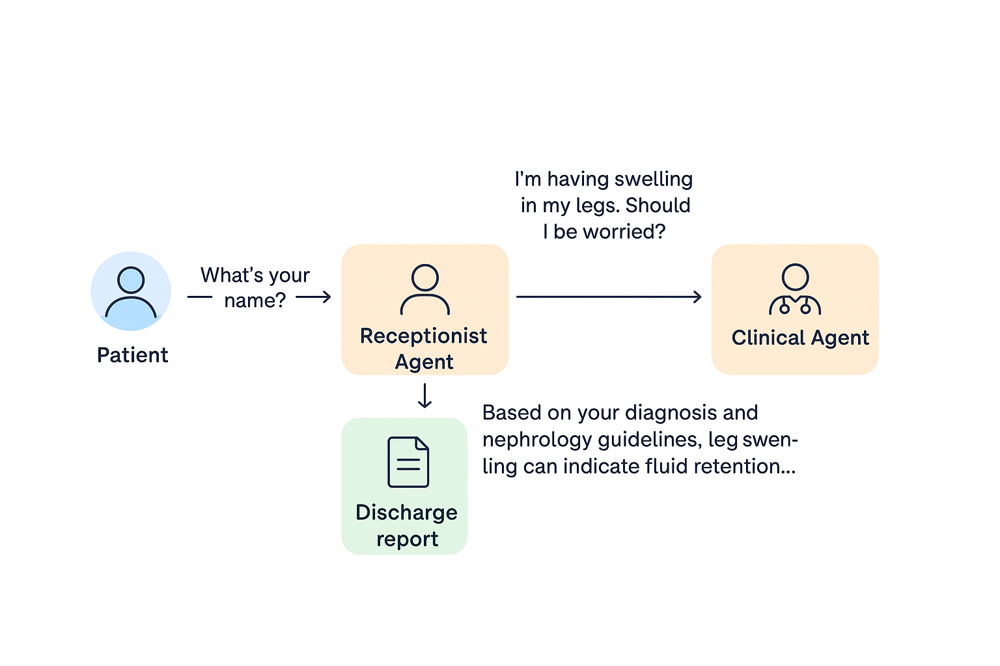

# 🏥 Post Discharge Medical AI Assistant (POC)

### Built by: Sahim Kazi

This project is a **multi-agent Generative AI system** designed to assist patients after hospital discharge.  
It demonstrates **LangChain**, **Gemini-2.5-Flash**, and **RAG (Retrieval-Augmented Generation)** with a simple **Streamlit** web interface.  
The project fulfills the *DataSmith AI – GenAI Intern Assignment* requirements.

---

## 🚀 Overview

The **Post Discharge Medical AI Assistant** helps patients review discharge instructions, clarify medications, and ask medical questions.  
It features two collaborating agents:

- **Receptionist Agent** → Greets patients, retrieves discharge data, and routes medical queries.  
- **Clinical Agent** → Handles medical questions using RAG over nephrology reference materials.

All interactions are logged, and dummy patient data ensures privacy and reproducibility.

---

## 🧠 System Architecture

- **Frontend:** Streamlit for patient interaction.
- **Backend:** Python + LangChain for multi-agent logic.
- **LLM Engine:** Gemini-2.5-Flash for reasoning and dialogue.
- **Vector Store:** FAISS for semantic retrieval.
- **Embeddings:** `all-MiniLM-L6-v2` from SentenceTransformers.
- **Storage:** JSON for patient data and logs.
- **Dummy Data:** Generated using Faker library.
- **Reference Source:** `nephrology.pdf` (processed and chunked for RAG).

---

## 🧩 Workflow

1. **Patient** enters name → Receptionist Agent retrieves discharge report.
2. **Receptionist Agent** engages with follow-up questions.
3. If the query is **medical**, it routes to **Clinical Agent**.
4. **Clinical Agent** performs RAG using FAISS + nephrology reference material.
5. Response is generated with context and citations.
6. All interactions are **logged** for traceability.


---

## 🗂️ File Structure

```

📁 Post_Discharge_AI_Assistant/
│
├── embeddings/                     # Stores FAISS vector embeddings
├── model/                          # Model configurations or cached models
├── venv/                           # Virtual environment
├── **pycache**/                    # Compiled cache files
│
├── .env                            # Environment variables (API keys, etc.)
├── .gitignore                      # Git ignore file
│
├── clinical_agent.py               # Defines Clinical Agent (RAG + LLM logic)
├── clinical_agent.log              # Log file capturing all agent interactions
├── receptionist_agent.py           # Receptionist Agent logic (patient queries)
├── patient_lookup.py               # Patient lookup tool for JSON database
├── process_pdf.py                  # Nephrology PDF processor and chunker
├── generate_dummy_patients.py      # Creates 25+ dummy discharge records
├── llm_engine.py                   # Handles Gemini-2.5-Flash integration
├── main_app.py                     # Streamlit app (entry point)
│
├── nephrology.pdf                  # Reference material used for RAG
├── patient_reports.json            # Dummy patient discharge records
├── requirements.txt                # Python dependencies
│
└── A_flowchart_in_digital_vector_graphic_illustrates_.png  # Workflow diagram

````

---

## ⚙️ Installation & Setup

### 1️⃣ Clone the Repository
```bash
git clone https://github.com/<your-username>/Post-Discharge-AI-Assistant.git
cd Post-Discharge-AI-Assistant
````

### 2️⃣ Create Virtual Environment

```bash
python -m venv venv
source venv/bin/activate   # for macOS/Linux
venv\Scripts\activate      # for Windows
```

### 3️⃣ Install Dependencies

```bash
pip install -r requirements.txt
```

### 4️⃣ Set Environment Variables

Create a `.env` file and add your Gemini API key:

```bash
OPENAI_API_KEY=your_api_key_here
```

---

## ▶️ Run the Application

```bash
streamlit run main_app.py
```

Once started, open the Streamlit app in your browser.
You’ll be greeted by the **Receptionist Agent**, and can interact as a patient to test the multi-agent workflow.

---

## 🧾 Logging

* All user interactions and agent responses are saved in:

  ```
  clinical_agent.log
  ```
* Each log entry includes timestamp, agent name, message type, and action.

---

## 🧠 Key Features

✅ Multi-Agent Coordination (Receptionist + Clinical)
✅ RAG over Nephrology Reference PDF
✅ FAISS-based Semantic Search
✅ JSON-based Patient Database
✅ Streamlit Web Interface
✅ Detailed Logging
✅ Dummy Data via Faker
✅ Gemini-2.5-Flash LLM Integration

---

## 📊 Architecture & Workflow

You can visualize the system behavior in the included diagram:

* **System Architecture** (LangChain + Gemini + FAISS + Streamlit)
* **Workflow Diagram** → `A_flowchart_in_digital_vector_graphic_illustrates_.png`

---

## ⚠️ Disclaimer

> This AI assistant is developed **for educational and demonstration purposes only**.
> It is **not a substitute** for professional medical advice, diagnosis, or treatment.
> Always consult a healthcare provider for real medical concerns.

---

## 📘 Credits

Developed by **Sahim Kazi**
For **DataSmith AI – GenAI Intern Assignment (Post Discharge Medical AI Assistant POC)**
